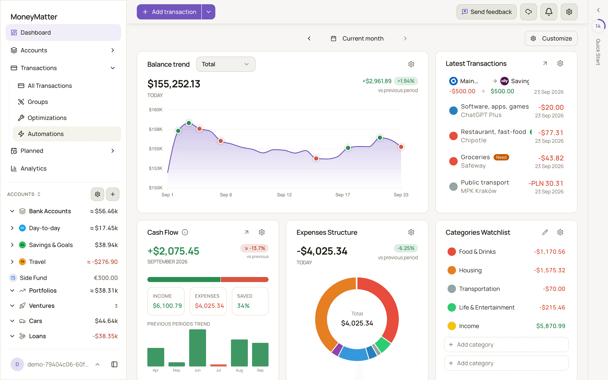
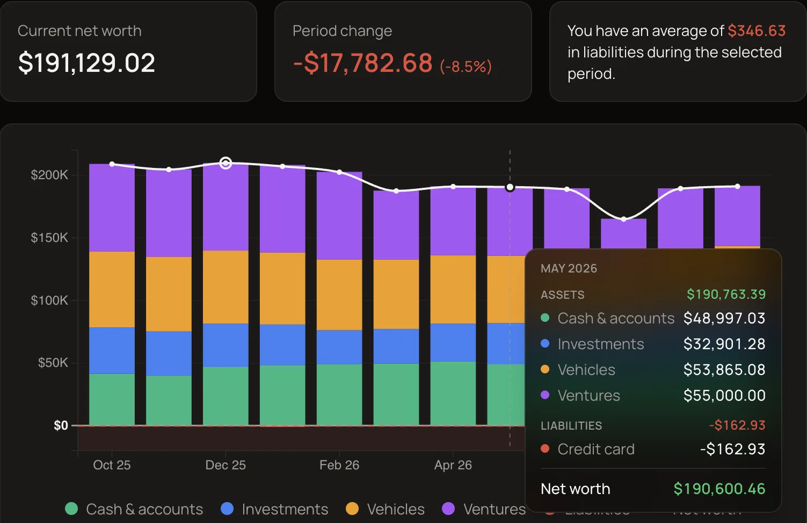
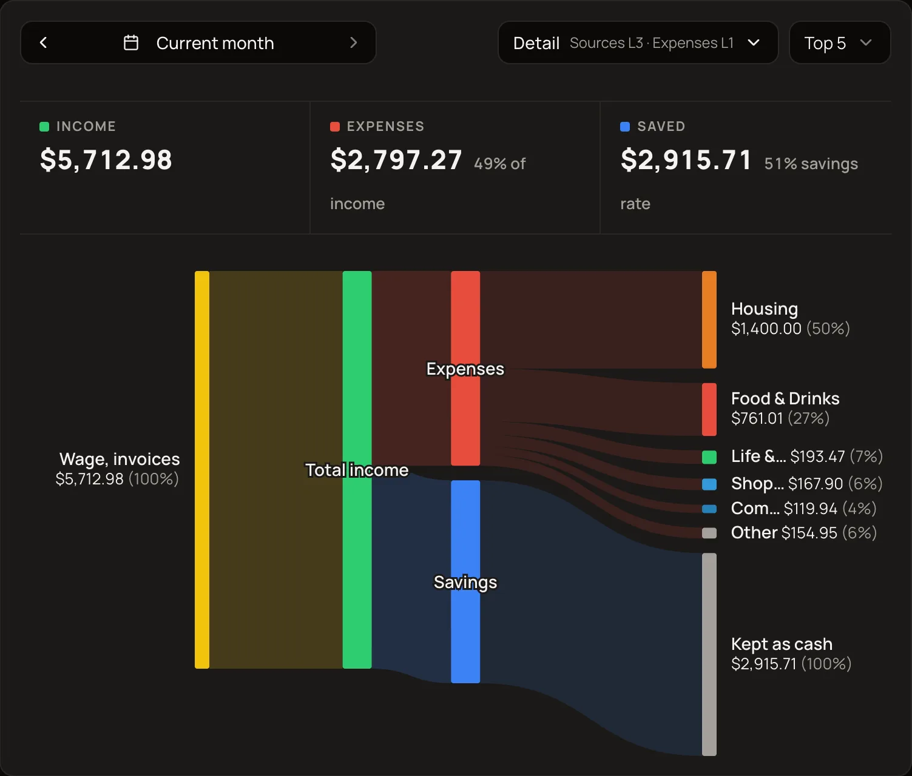
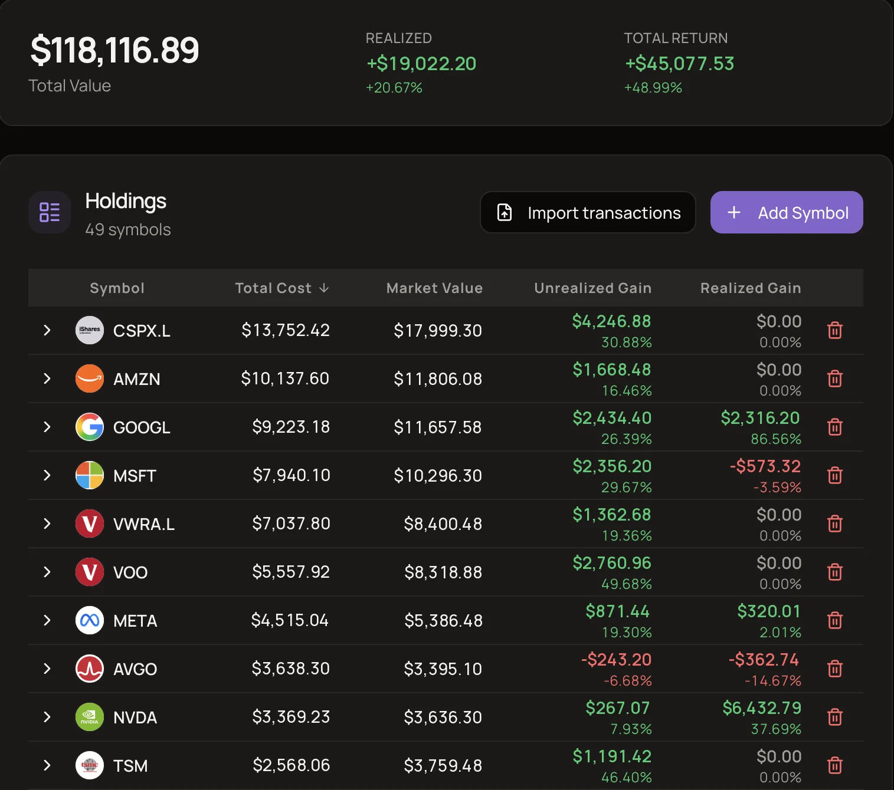
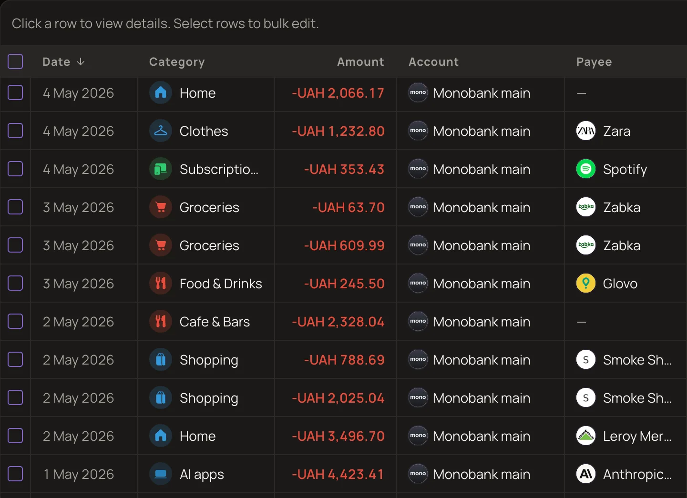
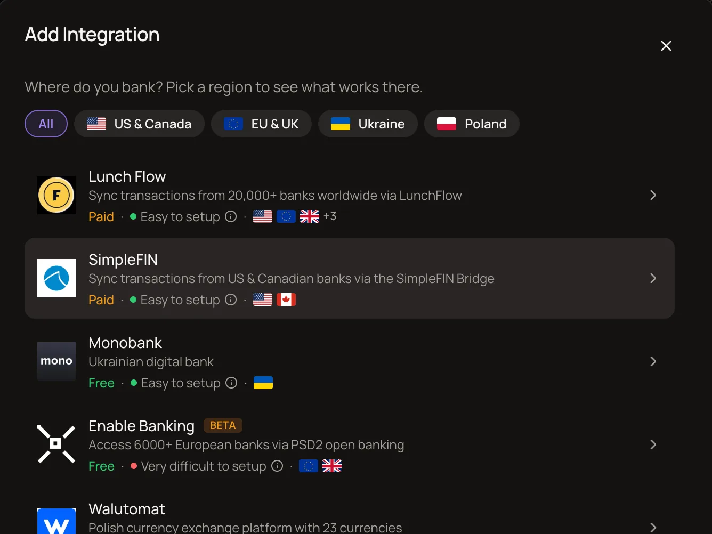
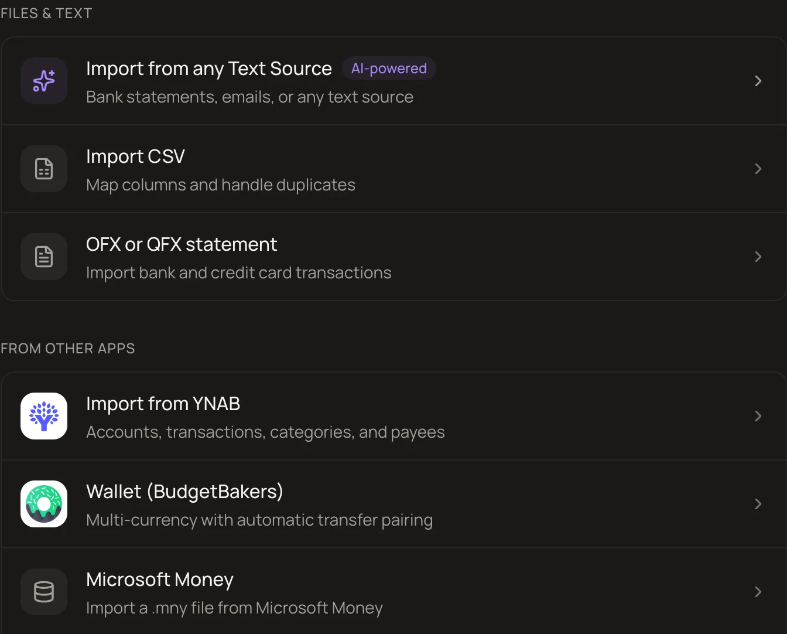

# MoneyMatter

**Open-source personal finance. Your finances, your server, your rules.**

Accounts, budgets, investments, loans and net worth in one place. 
Self-host it for free, or use the cloud.

[Website](https://moneymatter.app) · [Docs](https://docs.moneymatter.app) · [Self-host](self-hosting/README.md) · [Cloud](https://moneymatter.app/sign-up) · [Roadmap](https://moneymatter.featurebase.app/dashboard/roadmap) · [Changelog](https://github.com/letehaha/moneymatter/releases)

A personal finance application. Track balances and transactions with bank connections or manual entry, organize and analyze expenses and income, and plan spending in one place.

<picture>
  <source media="(prefers-color-scheme: dark)" srcset="packages/docs/public/screenshots/getting-started/app-overview.dark.png">
  
</picture>

<b>More screenshots</b>

 

<table>
  <tr>
    <td width="50%">
      
       Net worth history
    </td>
    <td width="50%">
      
       Money flow
    </td>
  </tr>
  <tr>
    <td width="50%">
      
       Investments
    </td>
    <td width="50%">
      
       Transactions
    </td>
  </tr>
  <tr>
    <td width="50%">
      
       Bank connections
    </td>
    <td width="50%">
      
       Import sources
    </td>
  </tr>
</table>

Every feature is explained, with screenshots, in the [help center](https://docs.moneymatter.app).

The app ships in English, Ukrainian, Spanish and Indonesian. Translation files are maintained directly in the repository under `packages/frontend/src/i18n/locales` and `packages/backend/src/i18n/locales`.

## License

This project is licensed under the **GNU Affero General Public License v3.0 (AGPL-3.0)**.

- ✅ Free to use, study, modify, and self-host
- ✅ Free to redistribute under the same license
- ✅ Commercial use permitted (sell hosting, support, custom builds, etc.)
- 🔄 Modifications must be released under AGPL-3.0
- 🌐 If you run a modified version as a network service, you must publish your modifications

See [LICENSE](LICENSE) for full details. The project was previously licensed under CC BY-NC-SA 4.0; that license still applies to versions of the codebase prior to the AGPL-3.0 relicensing commit.
